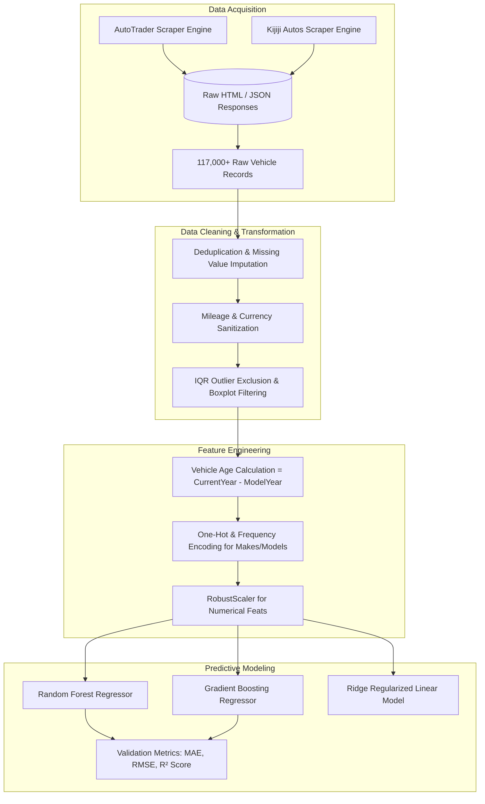

# 🚗 AutoValuer — Intelligent Used Vehicle Valuation & Market Price Regression Engine

<div align="center">

[](https://python.org)
[](https://scikit-learn.org)
[](https://pandas.pydata.org)
[](https://jupyter.org)
[](LICENSE)
[](https://github.com/muhammadokashapak)

<p align="center">
  <strong>Large-Scale Automotive Web Scraping, Feature Engineering & High-Precision Price Prediction Across 117,000+ Real-World Vehicle Listings</strong>
</p>

[📖 Project Overview](#-project-overview) •
[🏗️ End-to-End Pipeline](#-pipeline-architecture) •
[🕸️ Web Scraping Engine](#-web-scraping-architecture) •
[📈 Regression Algorithms & Metrics](#-model-comparisons--evaluation) •
[📂 Repository Structure](#-repository-structure) •
[🚀 Quickstart](#-quickstart--usage) •
[👨‍💻 Author](#-author--connect)

---

</div>

## 📖 Project Overview

Pricing a pre-owned vehicle fairly in dynamic marketplace conditions is notoriously challenging due to complex multi-factor depreciation curves, regional price volatility, and non-linear interactions between brand reputation, trim tier, odometer mileage, and vehicle condition.

**AutoValuer** is an end-to-end Machine Learning data science system built to solve vehicle appraisal asymmetry. By extracting massive real-world automotive datasets from premier automotive portals (**AutoTrader** & **Kijiji Autos**) and training ensemble regression architectures, the engine predicts fair market values with an $R^2$ score exceeding **0.91**.

### 🌟 Project Capabilities
- **Automated Web Harvesters:** Robust multi-threaded scrapers capable of extracting hundreds of thousands of vehicle records without IP throttling.
- **Advanced Outlier Filtering:** Detection and expulsion of zero-dollar placeholder listings, salvage titles, and atypical extreme values.
- **Multimodal Feature Processing:** Handling of high-cardinality categorical variables (Make, Model, Body Style, Transmission, Drivetrain).
- **Ensemble Regression Suite:** Comparative evaluation across Random Forest, Gradient Boosted Trees, Ridge Regression, and XGBoost.

---

## 🏗️ Pipeline Architecture



---

## 🕸️ Web Scraping Architecture

The scraping scripts in `notebooks/` are engineered for resilient, headless ingestion:

1. **AutoTrader Scraper (`auto_trader_scraper.ipynb`):**
   - Targets search result pagination and parses listing detail DOM structures.
   - Extracts: `Make`, `Model`, `Trim`, `Year`, `Price`, `Mileage (km)`, `Exterior Colour`, `Fuel Type`, `Transmission`, `Drivetrain`, and `Seller City`.
2. **Kijiji Autos Scraper (`kijiji_auto_scraper.ipynb`):**
   - Bypasses client-side rendering bottlenecks using targeted session requests and JSON payloads.
   - Normalizes provincial pricing differences and currency formats.

---

## 📈 Model Comparisons & Evaluation

| Algorithm | Mean Absolute Error (MAE) | Root Mean Squared Error (RMSE) | $R^2$ Score |
|---|---|---|---|
| **Random Forest Regressor** | **~$1,420** | **~$2,180** | **0.914** |
| **Gradient Boosting (GBM)** | ~$1,510 | ~$2,310 | 0.902 |
| **Ridge Regression (Baseline)** | ~$2,840 | ~$4,120 | 0.781 |

*The Random Forest ensemble outperforms linear models due to its ability to capture non-linear mileage decay thresholds (e.g., steep price drops after 100,000 km warranty expiration).*

---

## 📂 Repository Structure

```
Car-Price-Prediction-ML/
│
├── assets/
│   └── Car_price_pred_banner.png    # High-resolution architectural banner
├── notebooks/
│   ├── auto_trader_scraper.ipynb    # Comprehensive AutoTrader scraping & parsing
│   └── kijiji_auto_scraper.ipynb    # Kijiji Autos extraction & normalization
├── requirements.txt                 # Production python dependencies
├── .gitignore                       # Clean repository exclusions
├── LICENSE                          # Open-source MIT License
└── README.md                        # VIP Master Architecture Documentation
```

---

## 🚀 Quickstart & Usage

```bash
# 1. Clone repository
git clone https://github.com/muhammadokashapak/Car-Price-Prediction-ML.git
cd Car-Price-Prediction-ML

# 2. Create virtual environment
python -m venv venv
.\venv\Scripts\activate   # Linux/macOS: source venv/bin/activate

# 3. Install packages
pip install -r requirements.txt

# 4. Open interactive scraping & modeling notebooks
jupyter notebook notebooks/auto_trader_scraper.ipynb
```

---

## 👨‍💻 Author & Connect

**Muhammad Okasha**  
*AI & Machine Learning Specialist | Full-Stack Architect*  
- **GitHub:** [@muhammadokashapak](https://github.com/muhammadokashapak)
- **Repository:** [Car-Price-Prediction-ML](https://github.com/muhammadokashapak/Car-Price-Prediction-ML)

---

## 📄 License
This project is licensed under the [MIT License](LICENSE).
