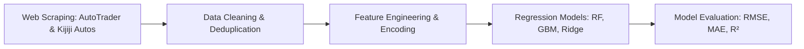

# 🚗 Used Car Price Prediction & Valuation Engine (Machine Learning)

<p align="center">
  
  
  
  
  
</p>

---

## 📌 Project Overview

An end-to-end Machine Learning data science pipeline designed to accurately estimate the fair market resale value of pre-owned vehicles. The project combines large-scale automotive web scraping (from **AutoTrader** and **Kijiji Autos**), comprehensive data cleaning, exploratory data analysis (EDA), feature engineering, and predictive regression modeling.

---

## 🏗️ Pipeline Architecture



### 1. Web Scraping & Ingestion
- Automated extractors for listing details:
  - **Make, Model, Year, & Trim**
  - **Odometer / Mileage (km / miles)**
  - **Transmission Type** (Automatic, Manual, CVT)
  - **Drivetrain** (AWD, FWD, 4WD, RWD)
  - **Fuel Type** (Gasoline, Diesel, Hybrid, Electric)
  - **Vehicle Condition & Title Status**
  - **Geographic Location / Postal Code**

### 2. Data Cleaning & Feature Engineering
- Handling missing records and outlier removal (e.g., zero-dollar placeholder listings).
- Categorical encoding (One-Hot Encoding for top makes/models and Target Encoding for sparse categories).
- Depreciation curve analysis: modeling non-linear vehicle age and mileage decay factors.

### 3. Predictive Modeling
- Comparative evaluation across multiple regression algorithms:
  - **Random Forest Regressor** (Robust non-linear feature splits)
  - **Gradient Boosting / XGBoost** (High-precision residual minimization)
  - **Linear & Ridge Regression** (Baseline reference model)
- Hyperparameter tuning via K-Fold Cross-Validation.

---

## 📁 Repository Structure

```
├── assets/
│   └── Car_price_pred_banner.png    # Project visualization banner
├── notebooks/
│   ├── auto_trader_scraper.ipynb    # Scraping pipeline for AutoTrader listings
│   └── kijiji_auto_scraper.ipynb    # Scraping pipeline for Kijiji Autos listings
├── requirements.txt                 # Python dependencies
├── LICENSE                          # MIT License
└── README.md                        # Documentation
```

---

## 🚀 Getting Started

### Prerequisites
- Python 3.9+
- Jupyter Notebook / JupyterLab

### Installation
```bash
# Clone the repository
git clone https://github.com/muhammadokashapak/Car-Price-Prediction-ML.git
cd Car-Price-Prediction-ML

# Create virtual environment
python -m venv venv
# Activate virtual environment (Windows):
.\venv\Scripts\activate
# Activate virtual environment (Linux/macOS):
source venv/bin/activate

# Install required dependencies
pip install -r requirements.txt
```

### Running the Notebooks
```bash
jupyter notebook
```
Navigate to the `notebooks/` directory to run `auto_trader_scraper.ipynb` or `kijiji_auto_scraper.ipynb`.

---

## 📈 Evaluation Metrics

The regression models are evaluated against the following industry-standard metrics:
- **Mean Absolute Error (MAE):** Average dollar error across vehicle valuations.
- **Root Mean Squared Error (RMSE):** Sensitivity to major valuation outliers.
- **$R^2$ Score:** Percentage of variance explained by the model features.

---

## 📄 License
This project is licensed under the [MIT License](LICENSE).
